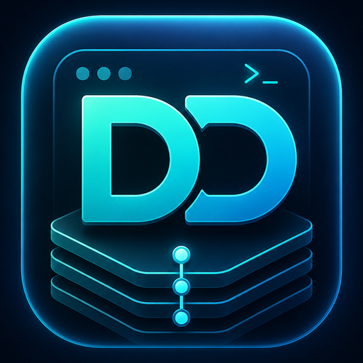

<div align="center">


# DevDeck

### Your local stack, under one glowing control deck.

DevDeck is a local-developer dashboard for running the whole messy orchestra: Azure Functions, Vite frontends,
.NET APIs, Node services, Docker Compose, custom commands, and whatever else your project needs. Configure once,
then start, stop, restart, stream logs, watch health, and route everything through **one reverse-proxy origin**.

<br/>


<br/>

**One browser tab. One gateway. Every service in reach.**

<br/>

[Quick start](#-quick-start) ·
[Features](#-features) ·
[Reverse proxy](#-reverse-proxy) ·
[Import / Export](#-import--export) ·
[Configuration](#%EF%B8%8F-configuration) ·
[Safety model](#-safety-model)

</div>

---

<table>
<tr>
<td width="64%" valign="middle">

## The local-dev command center

DevDeck turns terminal sprawl into a dashboard built for everyday development. It keeps process supervision,
logs, health checks, route configuration, and import/export close together, while the gateway at
`http://localhost:5050` makes your app stack feel like one coherent origin.

</td>
<td width="36%" align="center" valign="middle">

</td>
</tr>
</table>

---

## 💡 Why

Local development usually means juggling six terminals:

```text
Terminal 1: cd backend  && func start --port 7071
Terminal 2: cd frontend && npm run dev -- --port 5173
Terminal 3: cd api      && dotnet run --urls http://localhost:5080
Terminal 4: docker compose up
Terminal 5: tail -f logs/...
Terminal 6: trying to remember which one to Ctrl+C
```

DevDeck collapses that into one UI. Logs stream into a single panel. Health pills tell you what's actually up. A built-in reverse proxy at `http://localhost:5050` makes your frontend, API, and functions **share an origin** — so CORS stops being a daily nuisance and cookies behave consistently across services.

---

## ✨ Features

<table>
<tr>
<td width="50%" valign="top">

**🟢 Process supervision**
- Start, stop, restart, and watch any local command (`npm run dev`, `func start`, `dotnet run`, `docker compose up`, custom binaries).
- **Start all / Stop all** from the dashboard — a staggered ignite / power-down cascade animates cards as they come up and go down.
- Per-service environment variables, with **secret masking** in the UI.
- **Process-tree kill** on stop — `npm` and all its children go down together.
- Run history per service: start/stop timestamps, exit codes, downloadable logs.

**📦 Launch profiles**
- Group services into named profiles ("Full Stack Dev", "Frontend Only").
- **Ordered start** with per-service start delays.

**📜 Live + persistent logs**
- 5,000-line in-memory ring buffer per service, auto-scrolling monospace panel.
- **VS Code-style semantic coloring** — log levels, HTTP verbs, status codes, durations, versions, file paths, and clickable URLs are tinted as they stream.
- Every line also written to `{slug}-{run}-{timestamp}.log` for archival.
- `[OUT]` / `[ERR]` / `[SYS]` / `[PRX]` stream tagging.

</td>
<td width="50%" valign="top">

**❤️ Health & port awareness**
- HTTP health checks on a background interval, with `Healthy` / `Unhealthy` / `Timeout` / `NotRunning` states.
- Port probes warn when a configured port is already in use.

**🔀 Reverse proxy (YARP) — first class**
- Path-based routing: `/app → :5173`, `/api → :5080`, `/functions → :7071/api`.
- Transforms: `None`, `RemovePrefix`, `AddPrefix`, `RemoveAndAddPrefix`, `SetPath`.
- Reserved paths can't be hijacked; **hot-reload** on every route edit.

**🔁 Import / Export**
- Move services, profiles, and routes between machines as portable JSON.
- Keyed by name, secrets masked by default.

**🖥️ Cross-platform**
- `npm` → `npm.cmd` on Windows, `npm` on Linux/macOS — automatic.
- Data under `%LOCALAPPDATA%\DevDeck` (Windows) or `~/.local/share/DevDeck` (Linux/WSL).

</td>
</tr>
</table>

---

## ⚡ Quick start

> **Prerequisite:** the [.NET 10 SDK](https://dotnet.microsoft.com/download).

```sh
git clone <your-fork-or-repo-url>
cd DevDeck
dotnet run --project DevDeck.Web
```

Then open **<http://localhost:5050>**.

DevDeck migrates its SQLite database on first launch and starts with an empty dashboard. Click **+ New service**, pick a preset, point it at a working directory, and hit **Start**. The earliest proof-of-life loop is:

```text
Create service → Start → See logs → Stop → See run history
```

> 💡 To run on a different port, change `DevDeck:ReverseProxy:GatewayBaseUrl` — the gateway binds Kestrel to exactly that URL.

---

## 🧩 Service presets

When you create a service, pick a preset to pre-fill the command, default port, URL, and health check. Every field stays editable, and arguments support the placeholders `{id}`, `{name}`, `{port}`, `{workingDirectory}`.

| Preset | Start command | Default port | Notes |
| --- | --- | --- | --- |
| **Azure Function** | `func start --port {port}` | `7071` | |
| **React / Vite** | `npm run dev -- --host 0.0.0.0 --port {port}` | `5173` | |
| **React (CRA)** | `npm start` | `3000` | sets `PORT={port}` env var |
| **Node API** | `npm run dev` | `3001` | health check `…/health` |
| **.NET API** | `dotnet run --urls http://localhost:{port}` | `5080` | health check `…/health` |
| **Docker Compose** | `docker compose up` | — | |
| **Custom** | *(you provide)* | — | bring your own binary |

Unknown placeholders are left intact with a UI warning rather than silently emptied.

---

## 🔀 Reverse proxy

Three routes give you a single-origin stack:

| Match path | Destination | Transform | Resulting request |
| --- | --- | --- | --- |
| `/app/{**catch-all}` | `http://localhost:5173/` | `RemovePrefix /app` | `http://localhost:5050/app/dashboard` |
| `/api/{**catch-all}` | `http://localhost:5080/` | `None` | `http://localhost:5050/api/weather` |
| `/functions/{**catch-all}` | `http://localhost:7071/` | `RemoveAndAddPrefix /functions → /api` | `http://localhost:5050/functions/ping` |

Your browser sees one origin — `http://localhost:5050` — so CORS gets out of the way. Edits hot-reload into the live YARP snapshot without restarting DevDeck.

Each forwarded request is logged straight into the target service's log stream as a `[PRX]` pair — an inbound line and an outbound line carrying the response status, latency, and size:

```text
2026-05-25T09:14:02 [PRX] 127.0.0.1 --> GET /api/Catalog/items?page=2
2026-05-25T09:14:02 [PRX] 127.0.0.1 <-- 200 GET /api/Catalog/items -> http://localhost:7071/ 18ms 4.2 KB
```

> ⚠️ A bare catch-all (`/`, `/{**catch-all}`) for a SPA fallback is **disabled by default**. Enable `DevDeck:ReverseProxy:AllowCatchAllRoutes` to use one — otherwise the route is persisted but skipped (with a warning) when the proxy config is built.

---

## 🔁 Import / Export

DevDeck can serialize your configuration to portable JSON and re-import it on another machine. Services, launch profiles, and proxy routes each export to their own bundle (`schemaVersion: 1`), with foreign keys referenced **by name** so documents survive moving between machines.

- **Export** from the toolbar on the Services, Profiles, and Proxy Routes pages — one entity or the whole set.
- **Import** merges by name: existing entries are updated, new ones created.
- **Secrets are masked by default** — exported secret env vars carry a placeholder unless you explicitly opt to include real values; on import, the placeholder means "keep what's already in the DB."

A sample route bundle ships in this repo as [`devdeck-main-react-api-routes.json`](devdeck-main-react-api-routes.json):

```jsonc
{
  "schemaVersion": 1,
  "routes": [
    {
      "name": "Catalog",
      "serviceName": "FunctionAppCatalog",
      "destinationUrlOverride": "http://localhost:7071/",
      "matchPath": "/api/Catalog/{**catch-all}",
      "order": 0,
      "pathTransformMode": "RemoveAndAddPrefix",
      "pathPrefixToRemove": "/api/Catalog",
      "pathPrefixToAdd": "/api"
    }
    // …more routes
  ]
}
```

---

## 🗂️ How it's organized

```text
DevDeck.Web/
  Areas/Manage/         MVC controllers + views for the dashboard
  Data/                 EF Core entities, DbContext, paths helper
  Services/
    Runtime/            DevDeckProcessManager + log ring buffer
    Logs/               LogFileWriter (durable {slug}-{run}-{stamp}.log files)
    Health/             HealthCheckBackgroundService + PortProbeService
    Proxy/              DevDeckProxyConfigProvider + ProxyRouteBuilder + ReservedPaths
    Commands/           Presets, executable resolver, template renderer
    Portability/        JSON import/export of services, profiles, routes
  wwwroot/              devdeck.css design system, brand/favicon assets, dashboard/logs JS
  Migrations/           EF Core SQLite migrations
DevDeck.Tests/          xUnit unit tests
```

**Storage layout** — the separation is deliberate and load-bearing:

| What | Where it lives |
| --- | --- |
| Configuration + run summaries | **SQLite** — `{LocalAppData}/DevDeck/devdeck.db` |
| Live process state, log ring buffer, YARP snapshot | **Memory** |
| Durable stdout/stderr | **Files** — `{LocalAppData}/DevDeck/logs/*.log` |

> Full log streams are never stored in SQLite, and the proxy never queries SQLite per request — it serves from an in-memory snapshot with a change token.

---

## ⚙️ Configuration

Settings live in `DevDeck.Web/appsettings.json` under the `DevDeck` section:

```json
{
  "DevDeck": {
    "DevelopmentOnly": true,
    "AutoStartEnabledServices": false,
    "StopTimeoutSeconds": 10,
    "DashboardPollingMilliseconds": 1500,
    "MaxLiveLogLinesPerService": 5000,
    "LogTrimAmount": 1000,
    "LogRetentionDays": 14,
    "ReverseProxy": {
      "Enabled": true,
      "GatewayBaseUrl": "http://localhost:5050",
      "AllowExternalDestinations": false,
      "AllowCatchAllRoutes": false,
      "EnableAutoStartOnRequest": false,
      "LogProxyRequests": true
    }
  }
}
```

| Key | Default | What it does |
| --- | --- | --- |
| `DevelopmentOnly` | `true` | Gate management/execution actions behind a Development environment. |
| `AutoStartEnabledServices` | `false` | Start enabled services automatically on launch. |
| `StopTimeoutSeconds` | `10` | Grace period before a process tree is force-killed. |
| `DashboardPollingMilliseconds` | `1500` | Dashboard status poll interval. |
| `MaxLiveLogLinesPerService` / `LogTrimAmount` | `5000` / `1000` | Ring-buffer size and trim step. |
| `LogRetentionDays` | `14` | Age after which on-disk log files are pruned. |
| `ReverseProxy.GatewayBaseUrl` | `http://localhost:5050` | The single origin DevDeck (and the gateway) bind to. |
| `ReverseProxy.AllowExternalDestinations` | `false` | Permit proxy destinations outside localhost/private networks. |
| `ReverseProxy.AllowCatchAllRoutes` | `false` | Permit bare `/` and `/{**catch-all}` SPA-fallback routes. |
| `ReverseProxy.EnableAutoStartOnRequest` | `false` | (Reserved for future) start a service when its route is first hit. |
| `ReverseProxy.LogProxyRequests` | `true` | Log each proxied request as a `PRX` line pair — inbound request + outbound response (status, latency, size) — in the target service's log stream. |

`AllowExternalDestinations` is off by default — routes are restricted to `localhost`, `127.0.0.1`, `::1`, `*.localhost`, and RFC 1918 private networks (`10/8`, `172.16/12`, `192.168/16`). Flip it on only if you genuinely need to proxy something external.

---

## 🔒 Safety model

DevDeck spawns arbitrary local processes and exposes a reverse proxy, so a few rules are non-negotiable:

- **No raw command endpoint.** Every process start comes from a stored, validated service definition — there is no `POST /api/run` that takes a command string.
- **`/Manage` is reserved.** Proxy routes cannot match `/Manage`, `/manage`, `/css`, `/js`, `/lib`, `/images`, `/favicon.ico`, or `/_devdeck`.
- **MVC routes are mapped before YARP** — DevDeck's own UI always wins over a misconfigured proxy.
- **Catch-all routes are disabled** unless `AllowCatchAllRoutes` is explicitly set.
- **Destinations default to localhost / private networks**; public hosts require `AllowExternalDestinations`.
- **Secrets** (env vars marked `IsSecret`) are masked in the UI and never logged.

DevDeck is designed for **local development only** — it isn't a production process manager or ingress gateway.

---

## 🛠️ Development

```sh
dotnet build                                            # build solution
dotnet test                                             # run all unit tests
dotnet run --project DevDeck.Web                        # launch on http://localhost:5050
dotnet ef migrations add <Name> --project DevDeck.Web -o Migrations
```

The `DevDeck.Tests` project covers the cross-platform-sensitive bits: command template rendering, executable resolution for both OSes, log buffer trim behavior, reverse-proxy transform building, reserved-path rejection, destination validation, and import/export round-trips.

> 🤖 Working with an AI assistant? [`CLAUDE.md`](CLAUDE.md) (and the mirrored [`AGENTS.md`](AGENTS.md)) capture the architecture, milestone order, and safety constraints agents should follow.

---

## 🗺️ Roadmap

**Implemented (v1)**

- ✅ Service CRUD, presets, environment vars, health checks
- ✅ Process supervisor with run history + log files
- ✅ Launch profiles with ordered start
- ✅ YARP reverse proxy with hot reload, transforms, and validation
- ✅ Import / export of services, profiles, and routes
- ✅ Dashboard polling, custom dark UI

**Future work**

- ⏳ SignalR live log streaming (currently HTTP polling)
- ⏳ Auto-start-on-proxy-request (currently returns 503 when destination is down)
- ⏳ Host-based proxy routing (`app.localhost:5050`)
- ⏳ WSL execution mode
- ⏳ HTTPS / TLS for the gateway
- ⏳ DPAPI-backed secret encryption

---

## 📄 License

MIT — see [LICENSE](LICENSE).
